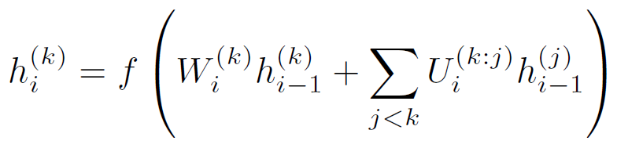

# Progressive Neural Net based on DQN
Code for a simplified version of paper <a href="https://arxiv.org/abs/1606.04671">Progressive Neural Networks</a>, on top of the <a href="https://www.nature.com/articles/nature14236">DQN</a> architecture. Trains a DQN for a new game based on several frozen DQN models using the progressive neural network training architecture. This is a simplified version of Progressive Netowork where transfer is based on the following formula and just using the fully connected layers. 

We have used this implementation for our nested architecture which combines Progressive Neural Network and Actor-Mimic to provide better transfer learning for training an Atari agent. More details may be found here: [Tech Report]

## Installation

1. Install torch (http://torch.ch/docs/getting-started.html#_).
2. Run ./install_dependencies.sh to install xitari and alewrap.
3. Find Atari 2600 ROMs and put them in roms/ directory.

## Experiments
NOTE: training the full pipeline from DQNs to transfer using Progressive architecure may take about two weeks with a fast GPU. 

## Training DQN
You may use the code available <a href="https://github.com/kuz/DeepMind-Atari-Deep-Q-Learner">here</a> to train the DQN and generate t7 torch files. Then, put the t7 files in experts/ directory. 

## Training Progressive network
To train progressive network, run following script:

	$ cd scripts
	$ ./run_progressive [1-based gpuid] ["'SourceGame_1','SourceGame_2','SourceGame_3'"] ["'TargetGame'"] [OutputFile]
 
Here, the first parameter is the GPU id, the second parameter is a list of source games (that is, the ones with frozen DQN networks), the third parameter is the Target game which we want to train a DQN for that, and the last parameter is the output file name. An example is:

	$ ./run_progressive 0 "'pong','breakout'" "'tennis'" tennis_progressive

## Acknowledgments
This implementation is an adapatation of <a href="https://github.com/eparisotto/ActorMimic">Actor-Mimic</a>, which provides code for the <a href="https://arxiv.org/abs/1511.06342">Actor-Mimic deep multitask and transfer reinforcement learning</a>. 

## References 
1. Human-level control through deep reinforcement learning, Nature 2015
2. Progressive Neural Networks, arXiv preprint 2016 
3. Actor-Mimic deep multitask and transfer reinforcement learning, ICLR 2016
